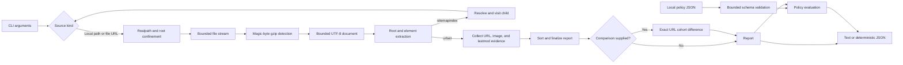

# Architecture and data flow

Sitemap Cohort Auditor is a dependency-free Node.js command-line application.
Its design favors bounded input, deterministic evidence, and explicit trust
boundaries over broad crawling behavior.

## Components

| Component | Responsibility |
| --- | --- |
| `bin/sitemap-cohort-auditor.mjs` | Parse CLI arguments, select text or JSON output, apply a policy, and map failures to exit codes. |
| `lib/audit.mjs` | Normalize sources, load and decode documents, traverse sitemap indexes, collect findings, compare cohorts, and format reports. |
| `lib/policy.mjs` | Parse a bounded local policy, validate its schema, evaluate report thresholds, and format policy findings. |

## Data flow

Traversal is depth-first. A visited-source set prevents repeat processing and
reports circular or duplicate child references. Reports are sorted before
serialization so the same stable inputs produce the same output.

## Trust boundaries

### Local files

Local sitemap indexes may reference only local children. Relative paths are
resolved from the parent document, and `file:` children are supported. The
initial path, each child and the comparison input must resolve within the real
read root. The default root is the initial sitemap's real parent; `--root`
explicitly widens it for a local export spanning sibling directories.

### Network boundary

There is no fetch path, redirect handler or network callback. URL source
arguments are invalid configuration; a remote child declaration makes the
local export incomplete without opening a connection.

### Resource bounds

- Each local file and each uncompressed XML document is limited to 50 MiB.
- A sitemap graph is limited to 10,000 distinct documents.
- Local policy input is limited to 64 KiB.

The input stream is bounded before and after optional gzip decompression. A
single decoded document is held in memory for extraction; the whole graph is
not retained as raw XML.

## Parsing model

The extractor recognizes the sitemap elements required by the report:
`urlset`, `sitemapindex`, `url`, `sitemap`, `loc`, `lastmod`, and `image:loc`.
It decodes common XML entities and numeric character references, trims element
text, and does not execute DTDs or expand custom entities.

This deliberately small extractor is not an XML-schema validator. Its boundary
is documented in [Limitations and non-goals](./limitations-and-non-goals.md).

## Comparison and policy

Cohort comparison uses exact decoded `<loc>` strings. It does not normalize
trailing slashes, case, query ordering, host aliases, or default documents.
Malformed entries remain visible in the cohort instead of silently dropping
out.

Policy evaluation happens after a successful audit. A definite policy failure
emits the report and exits `1`; incomplete evidence exits `2`. Invalid policy
configuration leaves stdout empty. Policies are local, versioned JSON and
cannot trigger network access.

A policy file that does not parse is reported by position, line, and column
only. `JSON.parse` has two error messages and one of them embeds the input —
`Unexpected token 'A', "AKIA…" is not valid JSON` for a short file, and a
ten-character window around the offending character for a long one — so a
policy file that is only a credential would otherwise be reproduced by its own
failure. Terminal escaping does not remove it, because a credential is
printable; `parseFailureDetail` drops the quotation and keeps the position.

## Security-sensitive changes

Changes to source normalization, read confinement, streaming bounds, decompression,
terminal escaping, policy parsing, or output ordering require focused tests and
maintainer review. See [SECURITY.md](../SECURITY.md) for private reporting.
